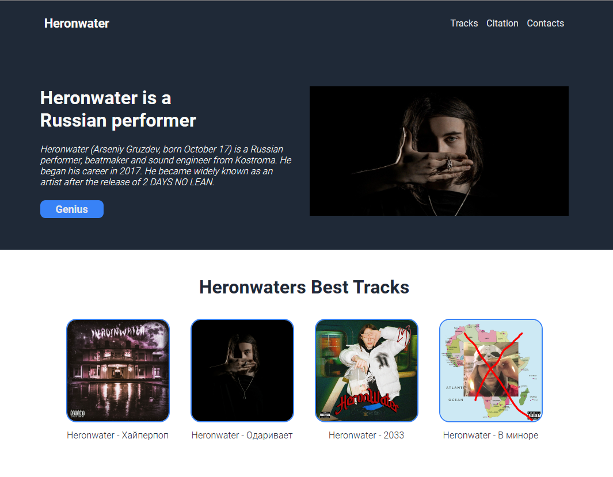

#### Heronwater

simple one-page site, to consolidate the practice of working with **classes html**, also **css**, **flexbox**, **hover**

##### Built With
- Visual Studio Code
- HTML
- CSS (flexbox)
- Git 

##### [View the site](https://mershana.github.io/Project-Landing-Page/)

---

**Project brief**: implement a website from a given design:

The assignment for this site was not only to repeat as on the layout, but also to try my creativity and thinking in terms of the designer, so I contributed some content from myself.

##### Acknowledgements:

images taken from [here](https://vk.com/heronwater1337)
information about the artist is taken from [here](https://genius.com/artists/Heronwater)

##### Authors
GitHub: [@Meshana](https://github.com/Mershana)

##### Show your support:

Give a ⭐️ if you like this project!
